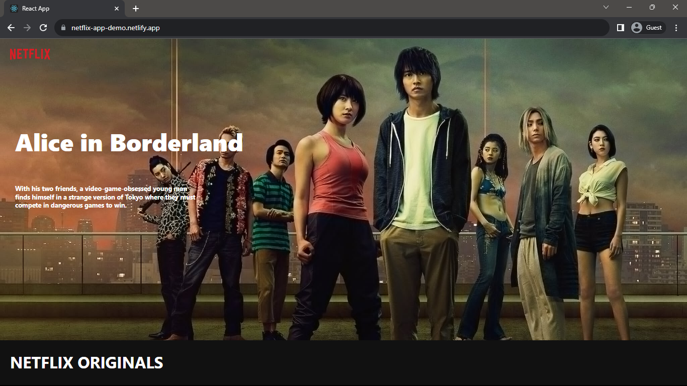
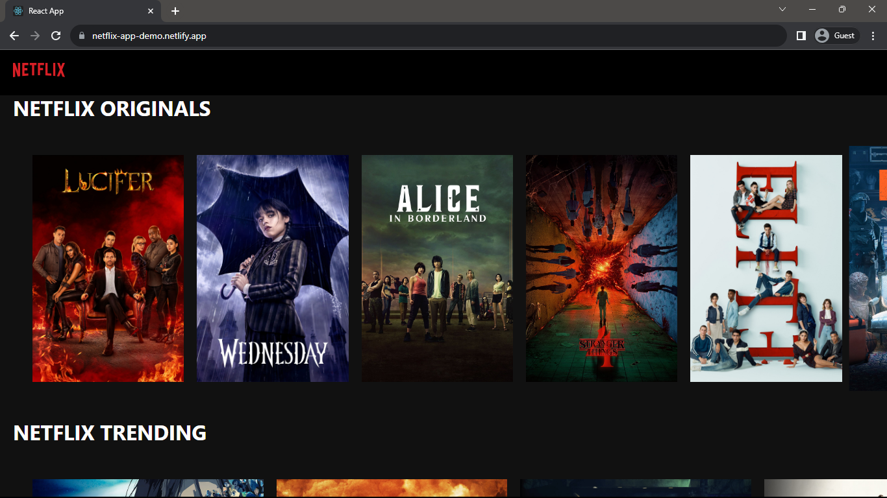
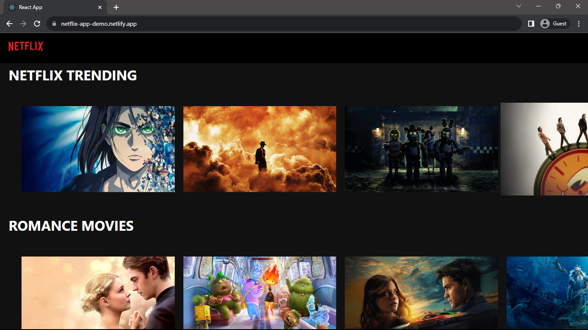

 <h1 align="center">Netflix UI Website</h1>

<h3>Project Description</h3>

Designed and implemented a React-based project that replicates the user interface of Netflix, utilizing external APIs to fetch and display dynamic content. The application provides users with an immersive and visually appealing experience reminiscent of the popular streaming platform. Leveraging React's component-based structure, the project faithfully mirrors the layout and design of Netflix, ensuring a seamless and intuitive navigation experience. By integrating external APIs, the content is kept up-to-date, offering users a real-time glimpse into the diverse range of media available.

<a href="https://netflix-app-demo.netlify.app">Netflix UI</a>